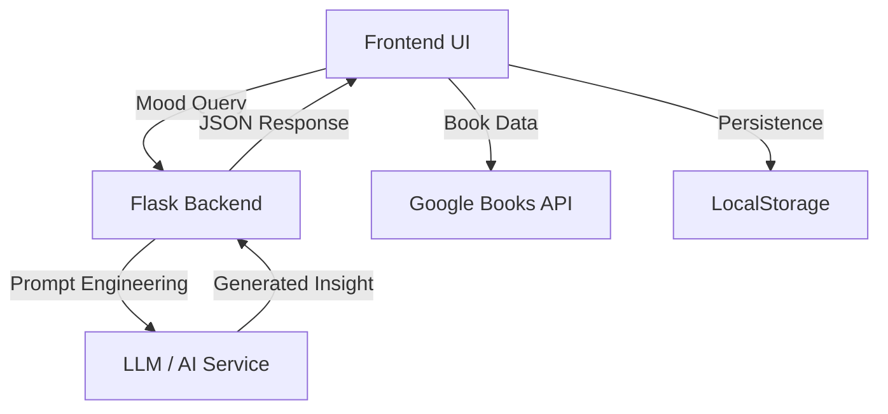

# 🌌 BiblioDrift — Drift Through Stories, Not Screens

[](https://bibliodrift-dm.netlify.app/)
[](docs/Open-Source-Event-Guidelines.md)
[](docs/Open-Source-Event-Guidelines.md)

> **"Find yourself in the pages."**  
> A calm, immersive, AI-powered book discovery experience.

---

## 🌿 The Idea

Most platforms make reading feel like:
- ❌ Endless scrolling  
- ❌ Algorithm overload  
- ❌ No emotional connection  

**BiblioDrift is different.**

It feels like:
> 📚 Walking into a quiet bookstore  
> ☕ Picking a book based on mood  
> 🌧️ Letting the atmosphere guide you  

---

## 🌟 Core Philosophy

- 🧘 **Zero UI Noise** → No clutter, no distractions  
- 🎭 **Vibe-First Discovery** → Search by *feeling*, not metadata  
- 📖 **Tactile Interaction** → Books behave like real objects  
- 🤖 **AI as a Bookseller** → Not recommendations, but *conversations*  

---

## ✨ Experience Highlights

### 📚 Interactive Library
- 3D books you can **pull, flip, and explore**
- Shelf-based organization (Want / Reading / Favorites)

### 🧠 AI-Powered Discovery
- Mood-based recommendations (e.g., *“rainy mystery”*)
- Dynamic AI-generated blurbs
- Conversational assistant → **Elara, the Bookseller**

### 🌌 Immersive UX
- Glassmorphism interface
- Ambient sounds (rain, fireplace)
- Emotion-based tagging system

### ⚡ Performance & UX
- Skeleton loaders (smooth loading)
- LocalStorage persistence
- Seamless interactions

---

## 🛠️ Tech Stack

| Layer | Technology |
|------|-----------|
| Frontend | HTML5, CSS3 (3D), Vanilla JS |
| API | Google Books API |
| Backend | Flask, SQLAlchemy, JWT cookies |
| AI | LLM-powered notes, chat, and mood analysis |
| Storage | LocalStorage |

---

## 🤖 AI-Only Recommendation System

BiblioDrift follows a strict rule:

- ❌ No hardcoded lists  
- ❌ No manual curation  
- ✅ 100% AI-generated discovery  

### AI considers:
- Mood  
- Emotional tone  
- Intent  
- Vibe  

---

## 🚀 Features Roadmap

- 🤖 AI-powered recommendations (core)  
- 🧠 Conversational librarian (Elara)  
- 🌧️ Mood-based discovery engine  
- 🎧 Ambient environments  
- 📊 Emotion analytics (future)  

---

## 🧠 System Architecture

> Frontend = Librarian  
> Backend = Curator  



---

## 🤖 Project Structure 

```text
BIBLIODRIFT/
│
├── backend/                     #  Python backend logic
│   ├── app.py
│   ├── ai_service.py
│   ├── cache_service.py
│   ├── config.py
│   ├── error_responses.py
│   ├── models.py
│   ├── security_utils.py
│   ├── validators.py
│   │
│   ├── mood_analysis/          # mood-based recommendation logic
│   └── purchase_links/         # purchase link generation
|   ├── price_tracker/   
│
├── frontend/                   #  UI (client-side)
│   ├── pages/                  # HTML files
│   │   ├── index.html
│   │   ├── auth.html
│   │   ├── chat.html
│   │   ├── library.html
│   │   ├── profile.html
│   │   └── 404.html
│   │
│   ├── js/                     # JavaScript
│   │   ├── app.js
│   │   ├── chat.js
│   │   ├── config.js
│   │   ├── footer.js
│   │   └── library-3d.js
│   │
│   ├── css/                    # Styles
│   │   ├── style.css
│   │   ├── style_main.css
│   │   └── style-responsive.css
│   │
│   ├── assets/                 # Images, sounds
│   │   ├── images/
│   │   └── sounds/
│   │
│   └── script/                 # extra JS (header scroll etc.)
│
├── config/                     # ⚙️ Configuration
│   ├── .env.development
│   ├── .env.example
│   ├── .env.testing
│   ├── requirements.txt
│   └── runtime.txt
│
├── docs/                       # 📚 Documentation
│   ├── contributing.md
│   ├── Open-Source-Event-Guidelines.md
│   ├── TUTORIAL.md
│   └── page.png
│
├── tests/                      # 🧪 Test files
│   ├── test_api.py
│   ├── test_llm.py
│   └── test_validation.py
│
├── .gitignore
├── README.md
├── LICENSE
├── netlify/                    # deployment config
├── script/ (if any left)       
├── venv/                       
└── .vscode/
```

---

## 🤖 AI Recommendation Policy

BiblioDrift follows a *strict AI-only recommendation model*.

- All recommendations must be generated dynamically using AI/LLMs.
- Manual curation, editor picks, static mood lists, or hardcoded book mappings are *not allowed*.
- AI outputs should be based on abstract signals such as:
  - Vibes
  - Mood descriptors
  - Emotional tone
  - Reader intent

This ensures discovery stays organic, scalable, and aligned with BiblioDrift’s philosophy of vibe-first exploration.

## 📦 Installation & Setup

### Frontend (Current MVP)
1. Clone the repository:
   bash
   git clone https://github.com/devanshi14malhotra/bibliodrift.git
   
2. Serve the frontend using a local HTTP server (do NOT open HTML files directly in the browser):
```bash
   cd frontend
   python -m http.server 8080
```
3. Start the backend:
```bash
   cd backend
   python app.py
```
4. Open `http://localhost:8080/pages/auth.html` in your browser.

> ⚠️ **Important:** Opening HTML files directly via `file:///` URLs will cause a CORS error (`TypeError: Failed to fetch`) because the browser blocks all fetch requests from a `null` origin. Always use a local server.

### Backend 
The Flask backend powers authentication, library sync, AI blurbs, chat, mood analysis, and other API flows.

## 🚢 Deployment Notes

- Netlify should serve the static frontend from the generated dist/ bundle.
- The Flask backend, database, Redis, and AI services are not hosted by Netlify.
- To make the API work in production, deploy the backend separately and point the frontend MOOD_API_BASE to that host.

##  Screenshots

<div align="center">
  <h3>Discovery & Virtual Library</h3>
  
  <br><br>
  
  
  <p><i>Capturing the tactile, vibe-first essence of BiblioDrift.</i></p>
</div>

---

## 🧠 AI Service Integration
To keep the frontend and backend synced, use the following mapping:

| Feature | Frontend Call (app.js) | API Endpoint (app.py) | Logic Provider (ai_service.py) |
| :--- | :--- | :--- | :--- |
| *Book Vibe* | POST /api/v1/generate-note | handle_generate_note() | generate_book_note() |

### API Integration
- *Endpoint*: POST /api/v1/generate-note
- *Logic*: Processed by ai_service.py

## 📡 API Request & Response Examples

### Endpoint: Generate Book Note

*Method:* POST
*URL:* /api/v1/generate-note
*Description:* Generates an AI-powered "bookseller note" based on the book's vibe, mood, and metadata.

---

### Request

*Headers*

json
{
  "Content-Type": "application/json"
}


*Body*

json
{
  "title": "The Night Circus",
  "author": "Erin Morgenstern",
  "mood": "mysterious, magical, slow-burn romance"
}


---

### Response

*Success (200 OK)*

json
{
  "status": "success",
  "note": "A dreamlike duel unfolds in a wandering circus of shadows and light. Perfect for readers who crave atmospheric magic and quiet intensity."
}


*Error (400 Bad Request)*

json
{
  "status": "error",
  "message": "Missing required fields: title or mood"
}


---

### API Flow Explanation

1. Frontend sends a POST request from app.js to /api/v1/generate-note.
2. The Flask backend (app.py) receives the request via handle_generate_note().
3. Input data (title, author, mood) is validated.
4. The request is passed to generate_book_note() in ai_service.py.
5. The AI model generates a contextual "bookseller note".
6. The backend returns the generated note as a JSON response.
7. Frontend displays the note in the book popup UI.


## 🤝 Contributing
We welcome contributions to make BiblioDrift cozier!

1. Fork the repo.
2. Create a feature branch such as feature/cozy-mode.
3. Make your changes and test them locally.
4. Push your branch and open a Pull Request.

See [CONTRIBUTING.md](CONTRIBUTING.md) for the fuller workflow and contribution rules.

## 📄 License
MIT License.

---
Built by Devanshi Malhotra and contributors, with ☕ and code.

If you like this project, please consider giving the repository a ⭐ STAR ⭐.
